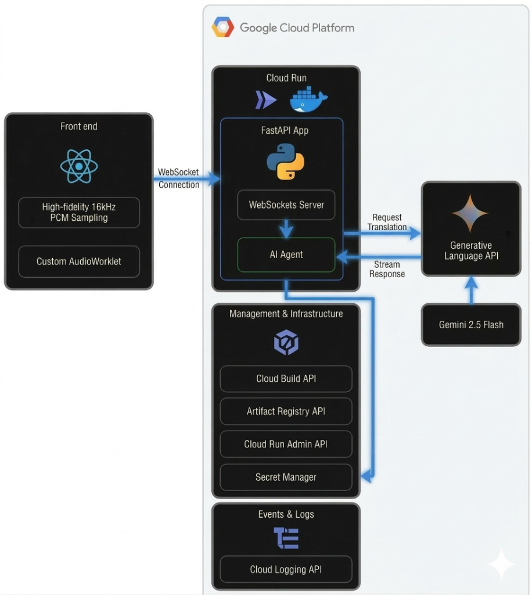

# 👅 BITTONGUE


---

## 📖 Description

**BITTONGUE** is a multi-platform AI translation agent designed for real-time dubbing in Spanish and English, offering an exceptional quality-to-price ratio. It functions as a versatile tool for audio, video, and live videoconferences, capturing audio directly from the system to provide a seamless voiceover experience. Engineered with a strict focus on maximizing cost-efficiency and quality, the system may exhibit a moderate level of latency as a deliberate architectural tradeoff.

### ⚡ Key Features:

*   🎙️ **Multimodal Audio Processing:** Direct audio-to-text-to-speech pipeline using **Gemini 2.5 Flash**, avoiding the errors of traditional intermediate STT layers.
*   🤖 **Fluid Context Memory:** The agent remembers the last stages of the conversation to ensure that translated sentences are fluent, connected, and grammatically consistent.
*   🚀 **Optimized Streaming:** Built on a WebSocket architecture that handles audio chunks efficiently to minimize synchronization gaps.
*   🔥 **Extreme Cost-Efficiency:** Designed to run on high-performance serverless infrastructure with minimal financial overhead.
## 🛠️ Tech Stack Architecture



The project is built around **Google Cloud Ecosystem** ensuring scalability, audio data with maximum security and high-performance AI integration.

### 💻 Core Framework & Frontend


*   **React 18:** The core UI framework orchestrating the real-time translation experience.
    *   **Web Audio API:** Low-level browser integration for capturing system audio seamlessly.
    *   **AudioWorklet:** Custom logic implemented for high-fidelity 16kHz PCM raw sampling.
*   **TypeScript:** Enforces strict type safety and architectural robustness throughout the frontend codebase.
*   **Tailwind CSS:** Utility-first styling for a dark, high-performance professional interface.

### 🧠 Artificial Intelligence (AI)


*   **AI Engine:** **Gemini 2.5 Flash**. Chosen for its superior speed-to-cost ratio and its ability to handle native audio bytes in the prompt.
*   **AI Development:** 
    *   **Prototyping:** Gemini Code Assistant via Google AI Studio (Gemini 3 Flash Preview).
    *   **Development:** Google Antigravity AI Agent (Gemini 3.1 Pro & Claude Sonnet 4.6).
*   **Streaming Mode:** Utilizes `generate_content_stream` to begin delivering translation chunks the moment the first words are processed.

### ☁️ Cloud Services


*   **Generative Language API:** AI Connection & Multimodal Live API.
*   **Gemini for Google Cloud API:** AI-assisted development and optimization.
*   **Cloud Logging & Monitoring:** Robust dashboarding, error reporting, and observability.
*   **Cloud Build API:** Automated deployment pipelines from source code.
*   **Cloud Storage APIs:** Essential backend storage for Cloud Build's containerization process.
*   **Secret Manager API:** Secure handling of sensitive keys and credentials.
*   **Cloud Run Admin API:** Service orchestration and management.
*   **Artifact Registry API:** Container image management.

### ☁️ Cloud Infrastructure


*   **Google Cloud Run:** Serverless environment for high-bandwidth audio processing.
    *   **Docker Container:** Application packaged entirely for consistent deployment.
    *   **Python 3.11 / FastAPI:** Backend engine optimized for low-latency WebSockets.

---

## 💵 Budget & Cost Analysis

*   **Initial Budget:** $100.00 USD
*   **Actual Total Spend:** $2.50 USD
*   **Savings:** 97.5% under budget.

### 📊 Performance vs Cost Breakdown

| Concept | Estimated Tokens (100 hrs) | Rate per 1M Tokens | Total Cost (USD) |
| :--- | :--- | :--- | :--- |
| **Input (Input Audio)** | 1.2 Million | $0.30 | $0.36 |
| **Output (Translated Text)** | 1.2 Million | $2.50 | $3.00 |
| **Voice Synthesis (TTS)** | N/A (Browser Native) | $0.00 | $0.00 |
| **Monthly Total** | **2.4 Million processed tokens** | | **$3.36 USD** |

---

## 🎥 Live Demo & Walkthrough

[Watch the BitTongue Demo on YouTube](https://youtu.be/blgKrNPIBd0)

[](https://youtu.be/blgKrNPIBd0)

---

## 🪄 How to Test BitTongue Locally

### 1. Local Environment Setup

To run BitTongue flawlessly on your local machine, open your terminal and follow these steps:

**1. Clone the repository:**
```bash
git clone https://github.com/gonzalezferrerx9/Bit-tongue.git
cd Bit-tongue
```

**2. Build the Frontend:**
Install Node.js dependencies and compile the React application:
```bash
npm install
npm run build
```
*(This generates the `dist` folder that the Python server needs to display the interface)*

**3. Start the Backend Server:**
Install the required Python libraries. Before running the server, you must **export your API key** to the terminal so Python can read it.

*On Windows (PowerShell):*
```powershell
pip install -r requirements.txt
$env:GEMINI_API_KEY="your_key_here"
python main.py
```

*On Mac/Linux:*
```bash
pip install -r requirements.txt
export GEMINI_API_KEY="your_key_here"
python main.py
```

### 3. Alternative: Run with Docker 🐳

If you prefer to run the application completely containerized, ensure you still run **Step 2 (Build the Frontend)** above so the `/dist` folder exists, and then run:

```bash
docker build -t bittongue-app .
docker run -p 8080:8080 -e GEMINI_API_KEY="your_key_here" bittongue-app
```

### 4. Usage Instructions

1.  Open your web browser and navigate to **`http://localhost:8080`**
2.  Select your **Target Language** in the settings.
3.  Click the **Start Capture Button** (Microphone icon).
4.  Allow "Screen/Audio Recording" permissions when prompted by the browser (required to capture system audio for dubbing).
5.  Play any video or join a call; the AI will instantly begin the translation stream!
